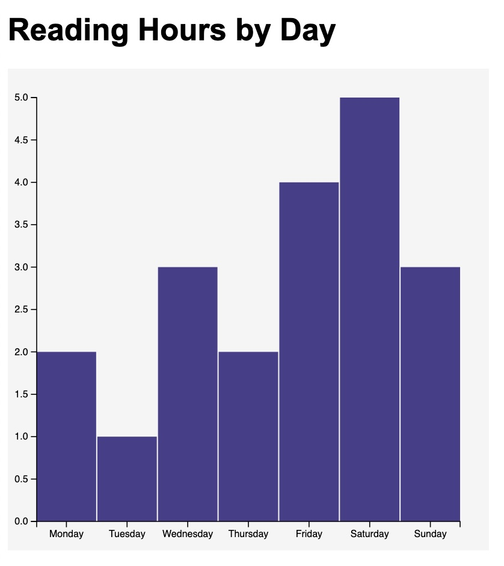

# D3 Homework 1: Reading Hours by Day

This project uses D3.js to create a bar chart showing the number of hours spent reading throughout the week.

The visualization loads data from an external CSV file and uses D3 scales and axes to display the data.

## Visualization

## Data Source

Personal reading data created for homework practice.
