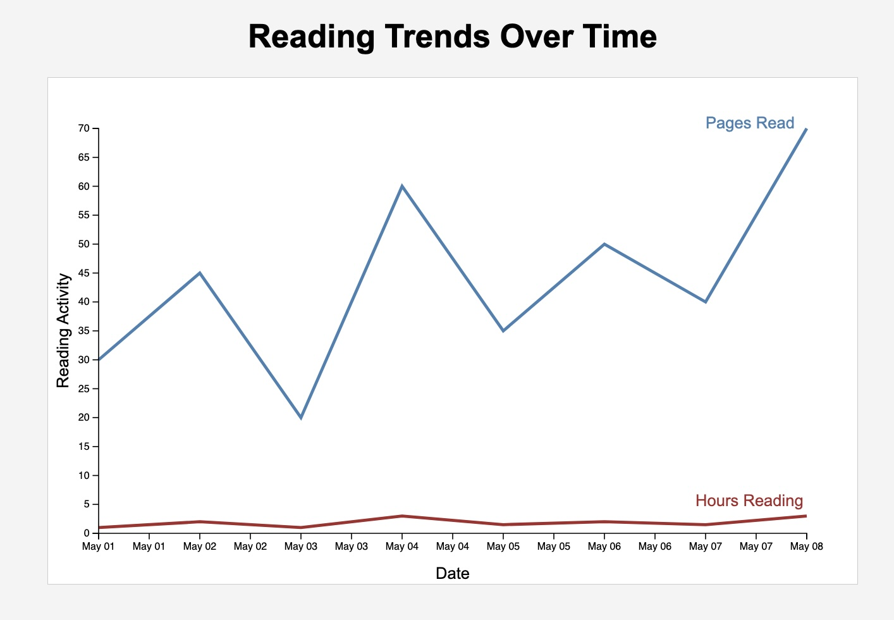

# D3 Reading Trends Visualization

This project is a multi-line chart created with D3.js and SVG.  
The visualization compares pages read and hours spent reading over time using data loaded from an external CSV file.

## Visualization Screenshot

## Data Source

Self-created reading data for assignment purposes.

## Resources
- Stack Overflow discussion on D3 line labels and markers:
  https://stackoverflow.com/questions/45700973/adding-data-label-and-marker-to-the-line-chart-using-d3
- Stack Overflow discussion on appending text to D3 lines:
  https://stackoverflow.com/questions/37723541/how-to-append-text-to-a-line-in-d3-js
- Used the following source to further help with bottom and left axis code:
  https://d3js.org/d3-axis
