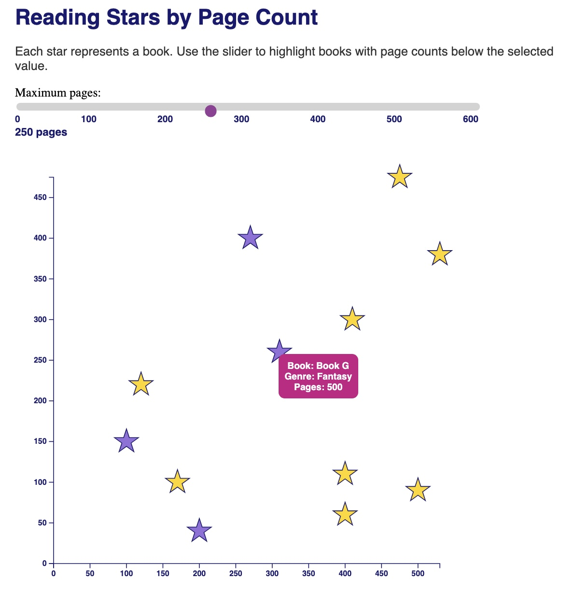

# Reading Stars by Page Count

## Description

This visualization shows books represented as stars on a scatterplot. 
The slider interaction allows the user to highlight books with page counts below the selected value. 
As the slider changes, stars with lower page counts turn gold while the remaining stars stay purple.

## Interaction

The interaction uses an HTML range slider and a JavaScript event listener. 
When the slider value changes, D3 updates the fill color of the stars based on the number of pages associated with each book.

## Data

The dataset was created by me for this assignment and includes:
- book title
- x position
- y position
- page count
- genre

## Design Choices

I used stars to visually match the reading theme and changed the colors to purple and gold for contrast. 
The tooltip displays additional information about each book when hovering over a star.

## Visualization

## Resources

- D3.js documentation
- Class examples and lecture code from the Interactivity module
