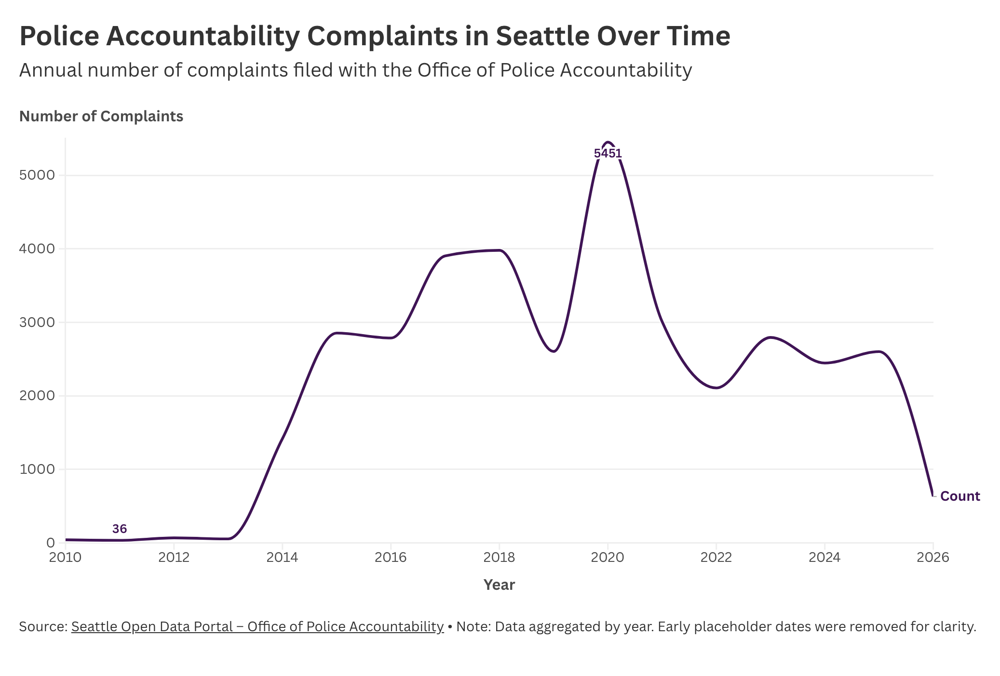

## Police Accountability Complaints in Seattle Over Time

This visualization shows the number of complaints filed annually with the Seattle Office of Police Accountability. The goal is to examine how complaints have changed over time.

The data was sourced from the Seattle Open Data Portal and cleaned using Python in VSCode. The dataset was aggregated by year to create a clear time trend. Early placeholder dates were removed to improve accuracy.

Link to published Flourish visualization: https://public.flourish.studio/visualisation/28545729/

Source:
Seattle Open Data Portal – Office of Police Accountability Complaints Dataset  
https://data.seattle.gov/
