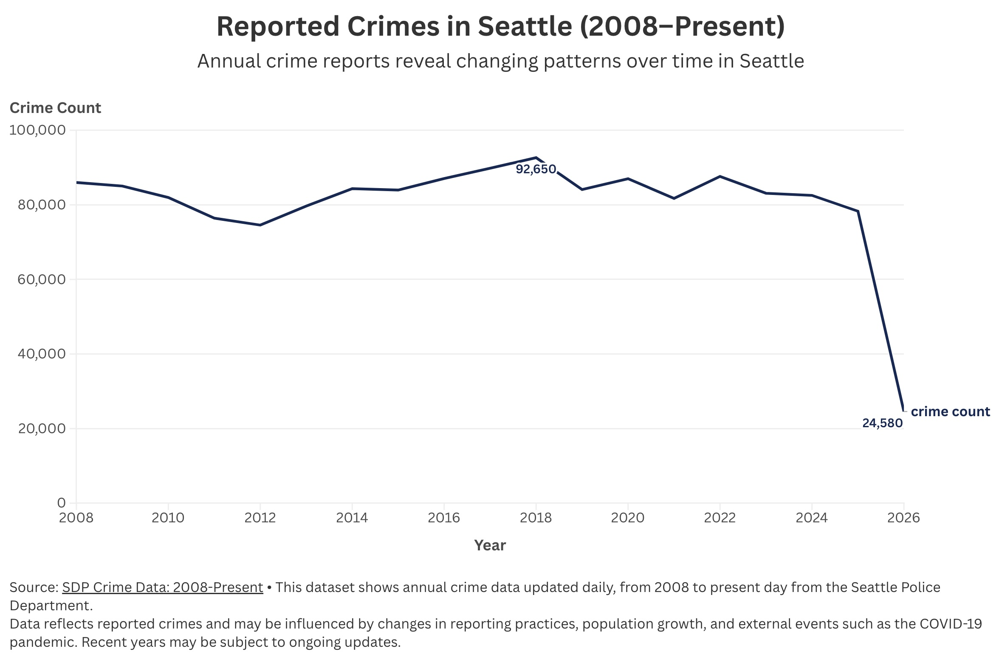

# Seattle Crime Data Analysis

This is my portion of our first group project which analyzes reported crime data in Seattle from 2008–Present using R and Flourish. The chart helps assess the accuracy and consistency of the dataset by showing a continuous and interpretable trend over time. Some of the major influences on the data could be due to changes in reported crime, population growth, and events such as the COVID-19 pandemic. There is not too large of a dip during the pandemic and the data from 2026 dips so low due to it still being ongoing. The continuous trend suggests the dataset is complete and reliably recorded across years. It also highlights patterns that make the data useful for understanding long-term changes in crime.

## Visualization

[View Interactive Chart on Flourish](https://public.flourish.studio/visualisation/28763483/)

## Methods
- Data cleaned using R (tidyverse, lubridate)
- Aggregated by year

## Data Source
[SPD Crime Data: 2008–Present](https://data.seattle.gov/Public-Safety/SPD-Crime-Data-2008-Present/tazs-3rd5/about_data)
